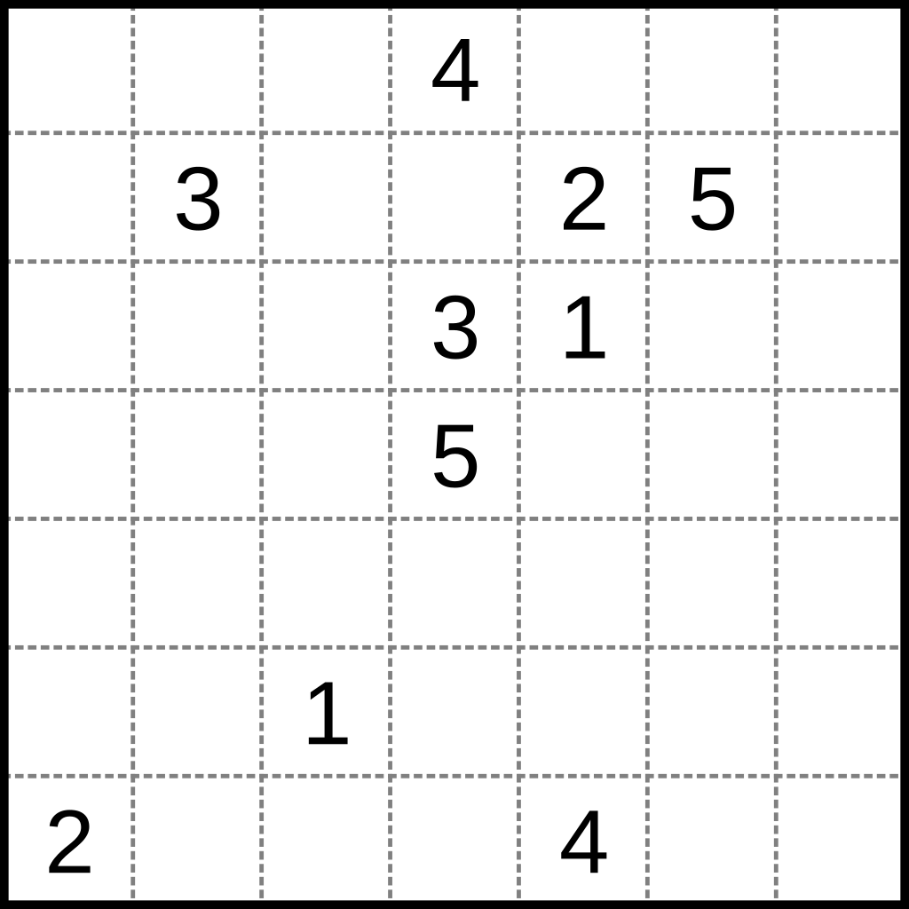

# Numberlink
- Program je funkční na Linuxu.
- Pro nejlepší čtení tohoto dokumentu: [Numberlink](https://www.notion.so/Numberlink-14d3d84aceaa800f8706db20dbd1c049?pvs=21)
- https://en.wikipedia.org/wiki/Numberlink

---

## Popis problému

Numberlink je typ logické hádanky zahrnující hledání nekřížících se cest, které spojují dvě stejná čísla v mřížce. Dostaneme mřížku, kde máme různé množství dvojic čísel náhodně umístěných v mřížce. Chceme je spojit cestami. Viz.:



Příklad 1.


Řešení 1.

**Pravidla:**

- Hráč musí spárovat všechna odpovídající čísla na mřížce pomocí jednoduchých souvislých cest.
- Cesty se nemohou rozvětvovat ani křížit a čísla musí padnout na konec každé cesty (tj. ne doprostřed)
- Každé pole mřížky musí být zaplněno
    
    ---
    

## Zakódování problému

*Constraints* generátory jsou v `numberlink.py` naleznutelné jako `generate_clauses_3D()` a `generate_clauses_4D()`. Očíslování constraintů v kódu i popisech níže je ekvivalentní.


---

### Zakódování č.1

*v programu `theory_name = '3D'`, `generate_all_clauses_3D()`, `generate_clauses_3D()`*

Velmi rychlý způsob, jak zakódovat problém jen pomocí **tří proměnných**:

- **$i$** - vertikální souřadnice v mřížce, tj. nabývá hodnot od $0$ až $výška -1$ mřížky
- $j$ - horizontální souřadnice v mřížce, tj. nabývá hodnot od $0$ až $šířka -1$ mřížky
- $p$ - cesta, které dané pole přísluší, tj. nabývá hodnot $1$ až $počet$ cest, $0$ je rezervovaná pro prázdná pole.
- ( $d$ - směr, který je roven, vždy $0$, tohle zakódování vzešlo ze zakódování níže a jednalo se o nejjednodušší způsob, jak jej převést. Proto budu dále počítat jen se třemi proměnnými. Nemá žádný vliv. Pro zachování a nepřepsání jsem se rozhodl i kvůli tomu, že obě zakódování používají velké množství společných metod - pro vykreslování, ukládání, apod.)

**Constraints:**

**Vstupní body** = [$(i_1,j_1,p_1,0)$, $(i_2,j_2,p_1,0)$, $(i_3,j_3,p_2,0)$, $(i_4,j_4,p_2,0)$,…, $(i_2*_n-_1,j_2*_n-_1,p_n,0)$, $(i_2*_n,j_2*_n,p_n,0)$] , kde $n$  je počet cest.

**Nevstupní body** = pole příslušící nevstupním číslům, tj. body, které nejsou vstupní.

1. Pole vstupních čísel (=vstupní body) jsou předem určena.
    
    ---
    
    Pro všechny **vstupní** body $(i,j,p,0)$ platí:
    
    - $⋀(i,j,p,0)$
    - $⋀not(i,j,p_1,0)$ , pro každé $p_1≠p$ z $[p_1,...,p_n]$
2. Každé pole, které nepatří vstupním číslům, má právě jednu cestu.
    
    ---
    
    Pro všechny **nevstupní** body $(i,j)$ platí:
    
    - $⋀​(i,j,p,0)​$, pro každé  $p$ z $[p_1,...,p_n]$ …. aspoň jednu
    
    Pro všechna $p_1$ z $[p_1,...,p_n]$ a $p_2$ z $[p_1,...,p_n]$ taková, že $p_1≠p_2$ platí:
    
    - $⋀not(i,j,p_1,0)∨not(i,j,p_2,0)$ …. nejvýše jednu
3. Všechna pole, která nepatří vstupním číslům, mají právě dva sousedy se stejnou cestou.
    
    ---
    
    Pro všechny **nevstupní** body $(i,j)$ a každou cestu $p$ z $[p_1,...,p_n]$ platí:
    
    - $⋀not(i,j,p,0)∨(n_1)∨...∨(n_k)$,  $n$, jsou sousedi ze všech kombinací o délce $(počet$ $sousedů$ $-1)$  možných sousedů …. aspoň dva
    
    Pro všechny **nevstupní** body $(i,j)$ a každou cestu $p$ z $[p_1,...,p_n]$ a pro každé tři sousedy $n_1≠ n_2≠ n_3$ z množiny sousedů $N$ bodu $(i,j)$ platí:
    
    - $⋀not(i,j,p,0)∨not(n_1)∨not(n_2)∨not(n_3)$ …. nejvýše dva
4. Každé pole patřící vstupním číslům má právě jednoho souseda se stejnou cestou.
    - Zde je vidět problém tohoto zakódování - nebude moct vyřešit určité instance problému. Viz. **Ukázka** v **Experimentování**.
    - Tahle podmínka je pro tohle zakódování avšak nezbytná, aby se cesta nenapojila zpátky na sebe.
    
    ---
    
    Pro všechny **vstupní** body $(i,j,p,0)$ platí:
    
    - $⋀(n_1)∨...∨(n_k)$, kde $n$ jsou možní sousedé pole $(i, j, p,0)$ …. aspoň jednoho
    
    Pro každé dva sousedy  $n_1≠ n_2$ **vstupního** pole $(i,j,p,0)$ platí: 
    
    - $⋀not(n_1)∨not(n_2)$ …. nejvýše jednoho

---

Tohle zakódování nevyřeší všechny instance, ale vyřeší skoro všechny. Ty které nevyřeší, tak jsou právě ty “uměle” vytvořené - např. s klikatící se (zig-zag) cestami. Většina numberlink desek jsou právě ty bez klikatících se cest, a proto tohle zakódování není úplně špatné.

Zakódování níže tyto klikatící se cesty zvládne správně vyřešit, avšak za cenu 4. proměnné ($d$ - směr), což bude pro velké mřížky znamenat zásadní problém.

Ze **Zakódování 1** lze získat výstup ve formě směrů, viz. níže, avšak získává se z konečného výsledku pomocí jednoduché logiky, ale samotné kódování se směrem vůbec nepočítá, to dělá až **Zakódování 2**

---

### Zakódování č.2

*v programu `theory_name = '4D'`, `generate_all_clauses_4D()`, `generate_clauses_4D()`*

Namísto tří proměnných máme 4 proměnné:

- **$i$** - vertikální souřadnice v mřížce, tj. nabývá hodnot od $0$ až $výška -1$ mřížky
- $j$ - horizontální souřadnice v mřížce, tj. nabývá hodnot od $0$ až $šířka -1$ mřížky
- $p$ - cesta, které dané pole přísluší, tj. nabývá hodnot $1$ až $počet$ cest, $0$ je rezervovaná pro prázdná pole. Každému poli přísluší právě jedna cesta.
- $d$ - směr, který kterému dané pole přísluší, tj. nabývá hodnot $1$ až $6$, $0$ je rezervovaná jako směr vstupních zadaných čísel, tj. žádný směr. Každému nevstupnímu poli přísluší právě jeden z šesti směrů.
    - číslům  $1$ až $6$ odpovídají znaky:     1 = "│", 2 = "─", 3 = "┘", 4 = "└", 5 = "┐", 6 = "┌"

**Constraints:**

1. Pole vstupních čísel jsou předem určena.
    
    ---
    
    Pro všechny **vstupní** body $(i,j,p,0)$ platí:
    
    - $⋀(i,j,p,0)$ …. platí vstupní bod
    - $⋀not(i,j,p_1,0)$ , pro každé $p_1≠p$ z $[p_1,...,p_n]$ …. neplatí body se stejnými souřadnicemi jako vstupní body, avšak s jinými cestami
2. Každé pole, které nepatří vstupním číslům, má právě jednu cestu a právě jeden směr.
    
    ---
    
    Pro všechny **nevstupní** body $(i,j)$ a každou cestu $p$ z $[p_1,...,p_n]$ a každý směr $d$ z $[1, ..., 6]$ platí:
    
    - $⋀(i,j,p,d)$ …. platí nevstupní bod
    
    Pro každé dva různé nevstupní body $(i_1,j_1,p_1,d_1)$$≠$$(i_2,j_2,p_2,d_2)$, kde $i_1 = i_2$ a $j_1=j_2$ platí:
    
    - $⋀not(i_1,j_1,p_1,d_1)∨not(i_2,j_2,p_2,d_2)$ …. dva body se stejnými souřadnicemi nemohou mít jiný směr nebo jinou cestu
3. Každé pole patřící vstupním číslům má právě jednoho souseda s možným směrem a stejnou cestou jako vstupní číslo.
    
    ---
    
    Pro každého souseda $n$ každého **vstupního** bodu $(i,j,p,0)$ a každou cestu $p’≠p$ z $[p_1,...,p_n]$ :
    
    - $⋀(n_1)∨...∨(n_k)$
    - $⋀not(n')$ … tzn. negace všech sousedů s cestou jinou než vstupní bod, tj. $p'$.
        
        …. aspoň jeden soused
        
    
    Pro každé dva sousedy  $n_1≠ n_2$ **vstupního** pole $(i,j,p,0)$ platí:
    
    - $⋀not(n_1)∨not(n_2)$ …. nejvýše jeden soused
4. Všechna pole, která nepatří vstupním číslům, mají právě dva sousedy se stejnou cestou a možným směrem.
    
    ---
    
    Nechť $g_1$ a $g_2$ jsou dvě skupiny sousedů nevstupního pole $(i,j,p,d)$, takové, že všechny body v $g_1$ mají stejné souřadnice $i,j$, to samé platí pro $g_2$, přičemž body v $g_1$ musí mít jiné než ty v $g_2$. Potom platí, že z každé skupiny $g_1$ a $g_2$ platí právě jeden soused:
    
    - $⋀not(i,j,p,d)∨(n_1)∨...∨(n_k)$, kde $n_1$ až $n_k$ jsou z $g_1$ …. alespoň jeden z $g_1$
    - $⋀not(i,j,p,d)∨not(n_1)∨not(n_2)$ pro každé $n_1≠ n_2$ z $g_1$ …. nejvýše jeden z $g_1$
    - $⋀not(i,j,p,d)∨(n_1)∨...∨(n_k)$, kde $n_1$ až $n_k$ jsou z $g_2$ …. alespoň jeden z $g_2$
    - $⋀not(i,j,p,d)∨not(n_1)∨not(n_2)$ pro každé $n_1≠ n_2$ z $g_2$ …. nejvýše jeden z $g_2$
    
     **Možné směry:**
    
    - jedná se o směry, které můžou navazovat na dané políčko:
    - Získávání směrů sousedů zastřešuje pro případ vlevo funkce `get__se_points_neighbours()` a pro případ vpravo `get_not_se_points_neighbours()`, obě dvě jsou v `numberlink.py`.


Vstupní číslo má směr 0, může mít 4 sousedy, z nichž každá může mít 3 různé směry.


Směr └ má dva možné sousedy, z nichž každy může mít až 4 různé směry, resp. 3 a může směřovat do vstupního čísla)

Např. (2, 4, 2, 3) znamená, že pole na vertikální pozici 2, na horizontální pozici 4, přísluší cestě 2 a má směr 3 = ┘.

---

Obě tyto zakódování mají problém - **`CYKLY`**. Ani jedno zakódování nezaručí, že ve výsledku nevznikne cyklus. Tj. mimo cestu spojující dvě čísla někde nezávisle na této cestě může vzniknout cyklus, tj. nějaká kružnice která má stejné $p$ jako daná cesta. Tohle nastane díky tomu, že souvislost cesty je zaručena tak, že každé pole, které není vstupní, má dva možné sousedy. To nezabrání cyklům. 

- Dlouho jsem se snažil vytvořit další zakódování, které cyklům předejde:
    - Indukcí - tj. pole přísluší cestě, pokud jeho soused jí přísluší.
    - Nalezením všech možných cest pomocí DFS, což vede na exponenciální čas.
    
    Ale nezvládl jsem problém zakódovat tak, aby předešel cyklům. Nemám proto důkaz, ale myslím si, že cyklům předejít nejde při zakódování do CNF.
    

Avšak v programu je eliminace cyklů řešena:

- Normálně se zakóduje vstup podle zvoleného zakódování a pak se spustí  SAT solver.
- Pokud SAT solver nalezne řešení, tak z modelu určí ohodnocení všech polí.
- Nalezne cykly - v mém programu řešeno, tak že se projdou cesty a nenavštívená pole jsou právě poli cyklů. (`cycle_detect()` v `sat.py`)
- Znovu se na problém spustí SAT solver, ale k původním klauzulím se přidají právě ty zakazující tyto cykly, tj pole cyklů. viz. $0$. constraint v`generate_clauses_4D()` a `generate_clauses_3D()`.
    
    ```python
     # 0. Add clauses to eliminate cycles
    if len(_extra_clauses) != 0: ...
    ```
    
- Dokud jsou naleznuty nějaké cykly, tak se opakovaně spouští SAT solver s klauzulemi zakazující cykly.

---

## Program

- Je nutné mít nainstalované následující knihovny `matplotlib` a `numpy`

Pro spuštění programu je nezbytný [**Glucose SAT solver**](https://github.com/audemard/glucose).

Skládá se ze tří modulů a jednoho souboru obsahující unit testy. Program nepodporuje předávání parametrů pomocí příkazové řádky ⇒ je nutné názvy souborů nastavovat v `main.py`.

- `main.py` - jediný skript ke spuštění, zde se nastavuje cesta k instanci, cesta k `glucose` a způsob vizualizace řešení instance. Ostatní moduly, nejsou spustitelné.
- `numberlink.py` - obsahuje logiku pro převedení uživatelského vstupu do programu, zakódování problému a jeho uložení do formátu [**DIMACS CNF**](https://jix.github.io/varisat/manual/0.2.0/formats/dimacs.html)
- `sat.py` - spouštění sat solveru, detekce cyklů.
- `mainTest.py` - obsahuje unit testy pro velké množství instancí.
- `/instances/` - obsahuje přiložené instance - desky numberlinku.

Program ukládá problém zakódovaný v DIMACS CNF jako .cnf soubory do složky **CNFS** a výsledky SAT solveru do **RESULTS**

Ve složce **instances** jsou všechny přiložené instance.

---

Program defaultně spustí program s `theory_name = "3D+4D"`, což znamená, že se nejprve pokusí instanci vyřešit pomocí **Zakódování 1** a pokud nenalezne řešení, tak se o to pokusí se **Zakódováním 2**. To je nejoptimálnější způsob, jak instance řešit. 

Ničení cyklů lze vypnout při nastavení `cycle_breaker=False` v `main.py`:

```python
... = run_sat(glucose_path, instance_path, theory_name, cycle_breaker=False)
```

---

### Vstup

- Instance mřížky numberlinku musí být v textovém souboru **.txt**, který vypadá následovně:

```
.,.,.,4,.,.,.
.,3,.,.,2,5,.
.,.,.,3,1,.,.
.,.,.,5,.,.,.
.,.,.,.,.,.,.
.,.,1,.,.,.,.
2,.,.,.,4,.,.

```

```
1,.,.
.,.,1
2,.,2

```

```
1,.,.,.,1
2,.,.,.,2
.,.,.,.,3
3,.,4,.,4

```

- tj. `$.$` reprezentuje prázdné pole (nevstupní bod), a čísla jsou vstupní pole (body), oddělovačem je **`,`**
- **Důležité** = pro `cycle_breaker` je nutné používat **paralelní** verzi Glucose.
- **Důležité** = nelze používat $0$  pro cesty a musí se číslovat postupně, tj. pro dvě cesty je možné použít $1$ a $2$, nelze použít třeba $4$ a $11$, Program iteruje přes všechny cesty podle jejich počtu a ne podle nich samotných. Tj. nevalidní vstup:
    
    ```
    1,.,.,.,1
    4,.,.,.,4
    .,.,.,.,3
    3,.,9,.,9
    
    ```
    
- Pokud vstup není korektní, tak se program ukončí.
- Pokud, nejsou zadání vstupní čísla v párech, např. jen jedno z nich, tak je vstup nesprávný.

---

### Výstup

Program vypíše defaultně:

```
Numberlink
----------------------------------------
Solvable = True
----------------------------------------
width = 7
height = 7
number of paths = 5
sat real time = 0.00350499 s
number of variables = 245
number of clauses = 4427
----------------------------------------
┌─┐4──┐
│3└─25│
│└─31││
│┌─5│││
││┌─┘││
││1┌─┘│
2└─┘4─┘
```

dále podporuje několik dalších výstupů - všechny ve formě standardního výstupu:

- `numbered_board`  *=* pole příslušející konkrétní cestě mají její hodnotu
    
    ```
    [2, 2, 2, 4, 4, 4, 4]
    [2, 3, 2, 2, 2, 5, 4]
    [2, 3, 3, 3, 1, 5, 4]
    [2, 5, 5, 5, 1, 5, 4]
    [2, 5, 1, 1, 1, 5, 4]
    [2, 5, 1, 5, 5, 5, 4]
    [2, 5, 5, 5, 4, 4, 4]
    ```
    
- `*direction_board_list*`
    
    ```
    ['┌', '─', '┐', '4', '─', '─', '┐']
    ['│', '3', '└', '─', '2', '5', '│']
    ['│', '└', '─', '3', '1', '│', '│']
    ['│', '┌', '─', '5', '│', '│', '│']
    ['│', '│', '┌', '─', '┘', '│', '│']
    ['│', '│', '1', '┌', '─', '┘', '│']
    ['2', '└', '─', '┘', '4', '─', '┘']
    ```
    
- `*direction_board_string*`
    
    ```
    ┌─┐4──┐
    │3└─25│
    │└─31││
    │┌─5│││
    ││┌─┘││
    ││1┌─┘│
    2└─┘4─┘
    ```
    
- `heatmap` = graf, který zobrazuje dané cesty


- `*_sat_output*=True` v `main()` = vytiskne výstup z glucose solveru.
- `*_dimacs=True`* v `main()` =  **vytiskne DIMACS CNF zakódování

Nastavuje se v `main.py` v `print_sat_result()`

---

### Přiložené instance

- Je přiloženo větší množství instancí. Zde jsou tři, které popíšu:

1. `instance_5.txt` = malá splnitelná instance
    
    ```
    1,.,.,.,1
    2,.,.,.,2
    .,.,.,.,3
    3,4,.,.,4
    
    ```
    


---

1. `instance_6.txt` = malá nesplnitelná instance
    
    ```
    1,.,.,.,1
    2,.,.,.,2
    .,.,.,.,3
    3,.,4,.,4
    
    ```
    

---

1. `instance_10.txt` = splnitelná netriviální instance, (real time : 16.5868s, cpu time  : 53.4739s)
    
    ```
    .,.,.,.,.,.,.,.,.,.,.,.,.,.,.,.,.,.,.,.,.,.,.,.,.,.,.,.,.,.,.,.,.,.,.,.,.,.,.,.,.,1
    .,.,.,.,.,.,.,.,.,.,.,.,.,12,.,.,.,.,.,.,.,.,.,.,.,.,.,.,.,.,.,.,25,.,.,.,.,.,.,.,.,.
    .,.,5,.,.,.,.,.,.,.,.,.,.,10,.,17,62,.,56,61,60,18,.,.,.,.,.,.,50,.,.,.,.,.,.,.,49,.,39,.,.,.
    .,.,.,.,.,.,.,.,.,.,.,.,.,.,.,.,.,.,61,.,.,.,.,34,.,.,.,.,.,.,.,59,.,.,.,.,.,.,.,24,.,.
    .,.,.,.,.,.,.,.,.,.,.,.,.,.,.,.,62,15,60,.,.,.,.,.,.,56,.,.,.,46,.,47,.,.,.,.,.,.,.,.,49,.
    .,.,.,.,.,14,.,.,.,.,.,.,.,.,16,19,18,.,.,.,.,.,.,.,.,33,.,.,.,.,.,.,59,.,.,.,.,.,.,.,.,.
    .,.,.,4,.,13,.,.,.,.,.,.,.,.,17,.,.,.,.,.,55,53,.,34,.,35,.,.,.,.,48,.,.,.,.,.,.,.,.,.,.,.
    .,.,.,.,.,7,.,.,.,.,.,.,.,.,.,.,13,.,.,.,54,.,.,33,.,57,.,.,.,.,.,.,.,.,.,.,.,.,.,.,.,.
    .,.,.,.,.,12,.,.,.,.,.,.,.,.,3,41,42,.,.,.,53,.,52,32,.,.,.,.,.,57,.,.,.,.,.,.,.,47,.,.,.,.
    .,.,.,.,.,11,.,.,.,.,.,.,.,.,.,.,.,.,.,.,.,.,.,.,.,.,35,.,.,.,.,.,45,.,.,.,58,.,.,.,.,.
    .,.,.,.,.,10,.,.,.,.,.,.,.,.,.,.,.,.,.,55,.,.,.,.,21,.,.,.,51,.,.,.,.,26,.,.,46,.,.,.,.,.
    .,.,.,.,.,.,11,5,.,.,.,.,.,.,.,.,.,.,.,19,54,.,.,.,.,.,.,.,.,.,.,.,.,.,.,58,.,.,.,.,.,.
    .,.,.,.,.,.,.,.,.,.,.,.,.,.,.,.,.,.,.,52,.,.,.,.,.,.,.,.,.,.,.,.,.,.,.,.,.,.,.,.,.,.
    .,.,.,.,.,.,.,.,.,.,.,.,.,.,.,.,.,.,.,.,.,42,.,.,.,.,.,.,.,29,45,.,.,.,.,.,.,.,.,.,.,.
    .,.,.,.,.,9,8,6,.,.,.,16,.,.,.,.,.,.,.,.,.,.,.,32,51,.,.,.,.,.,.,.,.,.,.,.,28,.,.,.,.,.
    .,.,.,.,.,8,.,.,.,.,.,.,.,.,.,.,.,36,.,.,38,.,.,.,44,50,.,30,.,.,.,.,.,.,.,.,27,.,.,.,.,.
    .,.,.,.,.,.,7,.,.,.,.,.,.,.,.,.,.,.,41,22,.,22,.,.,.,43,23,31,.,.,.,.,.,.,.,.,26,.,.,.,.,.
    .,.,.,.,.,6,.,.,.,.,.,.,.,.,.,.,.,.,36,.,.,21,.,.,.,27,.,.,.,.,.,.,.,.,.,.,25,.,.,.,.,.
    .,.,.,.,.,.,.,.,9,15,.,.,14,.,.,.,.,.,37,.,20,44,.,.,.,.,.,43,.,31,.,.,.,.,.,.,24,.,.,.,.,.
    .,.,.,.,.,.,.,.,.,.,.,.,.,.,.,.,.,.,.,.,.,.,.,.,38,39,40,28,.,30,.,.,.,.,.,.,23,.,.,.,.,.
    .,2,.,.,.,.,.,.,.,.,.,.,.,.,.,4,.,.,.,.,20,.,37,.,48,.,.,.,.,29,.,.,.,.,.,.,.,.,.,.,.,.
    .,.,3,.,.,.,.,.,.,.,.,.,.,.,.,.,.,.,.,.,.,.,.,.,.,.,.,.,.,.,.,.,.,.,.,.,.,.,.,.,.,.
    .,.,.,2,.,.,.,.,.,.,.,.,.,.,.,.,.,.,.,.,.,.,.,.,.,40,.,.,.,.,.,.,.,.,.,.,.,.,.,.,.,.
    .,.,.,.,.,.,.,.,.,.,.,.,.,.,.,.,.,.,.,.,.,.,.,.,.,.,.,.,.,.,.,.,.,.,.,.,.,.,.,.,.,.
    1,.,.,.,.,.,.,.,.,.,.,.,.,.,.,.,.,.,.,.,.,.,.,.,.,.,.,.,.,.,.,.,.,.,.,.,.,.,.,.,.,.
    
    ```
    
    
    
- pozor, instance byla vyřešena pomocí **Zakódování 1**, **Zakódování 2** můj počítač nedokázal dokončit.

---

### Experimentování

Pomocí **Zakódování 2** program dokázal v rozumném čase vyřešit i ty nejtěžší instance. 

Pokud dojde k vytvoření velkého množství cyklů, tak program opět může běžet velmi dlouho.

**Ukázka**

- instance (`instance_9.txt`), která jde vyřešit jen v **Zakódování 2**, **Zakódování 1** vyhodí `Solvable = False`.

```
1,.,.,.
1,.,.,.
2,.,.,2
3,.,.,3
```

```
1┐┌┐
1┘││
2─┘2
3──3
```

---

## Tabulka

Využitý HW = RAM: 16.0 GB | AMD Ryzen 7 6800HS 3.20 GHz

- sat real time = čas, který vrátí glucose `c real time`
- time of run = celkový čas včetně čtení vstupu, vypsání výstupu, generace klauzulí, běhu glucose
- clauses per second = num of clauses / time of run

Tabulky jsou seřazeny podle num of clauses vzestupně.

Lze vypozorovat, že s rostoucí velikostí instance roste i doba běhu, a to vemi rychle.

### Zakódování 1

| width | height | num of paths | sat real time [s] | time of run [s] | num of variables | num of clauses | encoding | solvable | used instance | clauses per second |
| --- | --- | --- | --- | --- | --- | --- | --- | --- | --- | --- |
| 3 | 3 | 2 | 0.0016 | 0.0061 | 18 | 143 | 1 | F | instance_4.txt | 23442.623 |
| 5 | 4 | 4 | 0.0034 | 0.0074 | 80 | 1116 | 1 | T | instance_5.txt | 150810.811 |
| 7 | 7 | 5 | 0.0032 | 0.0128 | 245 | 4337 | 1 | T | instance_1.txt | 338828.125 |
| 14 | 14 | 15 | 0.0391 | 0.5151 | 2940 | 91771 | 1 | T | instance_11.txt | 178161.522 |
| 15 | 15 | 15 | 0.0746 | 0.8132 | 3375 | 107505 | 1 | T | instance_14.txt | 132199.951 |
| 42 | 25 | 62 | 37.8552 | 45.9938 | 65100 | 4968222 | 1 | T | instance_10.txt | 108019.385 |

---

### Zakódování 2

| width | height | num of paths | sat real time [s] | time of run [s] | num of variables | num of clauses | encoding | solvable | used instance | clauses per second |
| --- | --- | --- | --- | --- | --- | --- | --- | --- | --- | --- |
| 3 | 3 | 2 | 0.0006 | 0.4968 | 88 | 995 | 2 | F | instance_4.txt | 2002.818 |
| 5 | 4 | 4 | 0.0048 | 1.0401 | 440 | 9036 | 2 | T | instance_5.txt | 8687.626 |
| 7 | 7 | 5 | 0.0132 | 0.0493 | 1420 | 43262 | 2 | T | instance_1.txt | 877525.355 |
| 14 | 14 | 15 | 0.9395 | 3.6757 | 17490 | 1470257 | 2 | T | instance_11.txt | 399993.742 |
| 15 | 15 | 15 | 23.6614 | 26.2448 | 20100 | 1737117 | 2 | T | instance_14.txt | 66188.997 |
| 42 | 25 | 62 | - | - | 389980 | - | - | - | instance_10.txt | - |
- `instance_10.txt` - nedostatek paměti.

---

## Další ukázky vstupů a výstupů

`instance_4.txt`

```
1,.,.
2,.,1
.,.,2
```

```
Numberlink
----------------------------------------
Solvable = False
----------------------------------------
width = 3
height = 3
number of paths = 2
sat real time = 0 s
number of variables = 0
number of clauses = 0
----------------------------------------
1..
2.1
..2
```

---

`instance_7.txt`

```
1,.,.,.,.,.,.,.,.,.,.,.,.,.,.,.,.,.,.,.,.,.,.,.,.,.,.,.,.,.,.,.,.,.,.,.,.,.,.,.
.,.,.,.,.,.,.,.,.,.,.,.,.,.,.,.,.,.,.,.,.,.,6,.,.,.,.,.,.,.,.,.,.,.,.,.,.,.,.,.
.,.,.,.,2,4,.,4,.,.,.,.,.,.,.,.,.,.,.,.,.,.,.,.,8,.,.,.,.,.,.,.,.,.,.,.,.,.,.,.
.,.,.,.,.,.,.,5,.,.,.,.,.,.,.,.,.,.,.,.,.,.,.,.,.,.,.,.,5,.,.,9,3,.,.,.,.,.,.,.
.,.,.,.,.,.,.,.,.,.,.,.,.,.,.,.,.,.,.,.,.,.,.,.,.,.,.,.,.,.,7,.,.,.,.,9,.,.,.,.
.,.,.,.,3,.,.,.,.,.,.,.,.,.,.,.,.,.,.,.,.,.,.,.,.,.,.,.,.,.,.,.,.,.,.,.,.,.,.,.
.,.,.,.,.,.,.,.,.,.,.,.,.,.,.,.,.,.,.,.,.,.,.,.,.,.,.,.,.,.,.,.,.,.,.,.,8,.,.,.
.,.,.,.,.,.,.,.,.,.,.,.,.,.,.,.,.,.,.,6,2,7,.,.,.,.,.,.,.,.,.,.,.,.,.,.,.,.,.,.
.,.,.,.,.,.,.,.,.,.,.,.,.,.,.,.,.,.,.,.,.,.,.,.,.,.,.,.,.,.,.,.,.,.,.,.,.,.,.,.
.,.,.,.,.,.,.,.,.,.,.,.,.,.,.,.,.,.,.,.,.,.,1,.,.,.,.,.,.,.,.,.,.,.,.,.,.,.,.,.

```

```
Numberlink
----------------------------------------
Solvable = True
----------------------------------------
width = 40
height = 10
number of paths = 9
sat real time = 1.11924 s
number of variables = 3600
number of clauses = 108267
----------------------------------------
1──────────────────────────────────────┐
┌────┐┌───────────────6┌──────────────┐│
│┌──24│4───────────────┘8────┐┌──────┐││
││┌───┘5────────────────────5││93───┐│││
│││┌─────────────────────────┘7└───9││││
││││3───────────────────────────────┘│││
│││└────────────────────────────────8│││
││└────────────────627───────────────┘││
│└──────────────────┘┌────────────────┘│
└────────────────────┘1────────────────┘
```


---

`instance_11.txt`

```
.,.,.,.,.,.,.,.,.,.,.,.,.,.
.,1,.,.,.,1,.,.,.,.,.,.,.,.
.,.,.,.,.,.,.,.,.,.,.,12,.,.
.,.,.,.,.,.,.,.,4,.,.,.,.,.
.,2,.,.,.,.,.,.,.,.,11,.,.,.
.,.,.,13,12,.,15,.,.,.,.,.,.,.
.,.,14,.,14,.,.,13,.,.,.,.,.,.
11,.,.,.,.,.,.,15,.,.,.,7,.,.
.,.,.,.,7,.,.,9,.,5,.,.,.,.
.,.,.,.,8,.,.,8,.,6,.,.,.,.
.,.,10,9,.,.,.,.,.,.,.,.,.,3
.,.,.,.,10,.,.,.,.,.,5,.,.,.
.,.,.,.,.,.,.,.,.,.,.,.,2,.
.,.,.,.,.,.,.,6,.,4,3,.,.,.

```

```
Numberlink
----------------------------------------
Solvable = True
----------------------------------------
width = 14
height = 14
number of paths = 15
sat real time = 0.037955 s
number of variables = 2940
number of clauses = 91741
----------------------------------------
 ┌─ ─ ─ ── ─ ─── ─ ──┐
 │1 ─ ─ ─1 ┌ ─── ─ ─┐│
 │┌ ─ ─ ── ┘ ┌── ─12││
 ││ ┌ ─ ── ─ ┘4┌ ─ ─┘│
 │2 │ ┌ ── ─ ┐││11 ──┘
 │┌ ┘1312┐15 ││└ ─ ──┐
 ││14 ─14│ │13└─ ─ ─┐│
11└ ─ ─ ─┘ └15┌─ ─ 7││
 ┌─ ─ ─ 7┌ ─ 9│5 ┐ ┌┘│
 │┌ ─ ─ 8│ ┌ 8│6 │ │┌┘
 ││10 9 ─┘ │ ┌┘│ │ ││3
 ││ └ ─10┌ ┘ │┌┘ 5 │││
 │└ ─ ─ ─┘ ┌ ┘│┌ ─ ┘2│
 └─ ─ ─ ── ┘ 6┘4 3 ──┘
```


---

## Poznámky

Cesta může mít i jen dvě pole, tj. vede přímo z jednoho vstupního bodu do druhého.

```
.,2
.,1
2,1
```

---

Nastavit `*_echo*=True` v `main.py` v `run_sat()` ⇒ program bude vypisovat informace o fázích programu.

---